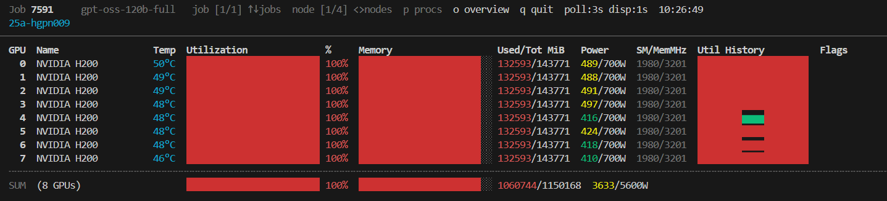

# nvnodetop — NVIDIA Node Cluster Top

<div align="center">

[](https://badge.fury.io/py/nvnodetop)
[](https://pypi.org/project/nvnodetop/)
[](LICENSE)
[](https://github.com/whats2000/nvnodetop/actions/workflows/publish.yml)

**An `nvtop`-inspired, real-time GPU monitor for SLURM HPC clusters.**  
Monitor every GPU across all your running jobs — with utilisation bars, sparkline history, power draw, ECC errors and per-process detail — all from a single terminal window.



</div>

---

## Table of Contents

- [Features](#features)
- [Requirements](#requirements)
- [Installation](#installation)
  - [Via pip (recommended)](#via-pip-recommended)
  - [Via pipx (isolated)](#via-pipx-isolated)
  - [Manual install](#manual-install)
- [Usage](#usage)
  - [Arguments](#arguments)
  - [Key Bindings](#key-bindings)
- [Display Layout](#display-layout)
  - [GPU Row](#gpu-row)
  - [Summary Row](#summary-row)
  - [Process Table](#process-table)
- [How It Works](#how-it-works)
- [Configuration](#configuration)
- [Troubleshooting](#troubleshooting)
- [Contributing](#contributing)
- [License](#license)

---

## Features

- 🖥️ **Multi-node, multi-job** — cycles through every node assigned to your running SLURM jobs
- 📊 **Rich GPU metrics** — utilisation, memory (used/total), temperature, power draw/limit, SM & memory clock speeds
- 📈 **Sparkline history** — rolling utilisation history plotted in-line with Unicode block characters
- ⚡ **Asynchronous polling** — each node is polled in a dedicated background subprocess; the UI never blocks waiting for SSH
- 🚨 **Alert flags** — thermal throttle (`!THERM`), power brake (`!PWR`), and uncorrected ECC errors are highlighted inline
- 👤 **Process table** — per-GPU process list showing PID, username, command and GPU memory (toggle with `p`)
- 📐 **Responsive layout** — bar widths adapt dynamically to the terminal width
- ♻️ **Graceful cleanup** — all background SSH pollers and the temporary cache directory are cleaned up on exit

---

## Requirements

| Requirement                      | Notes                                                                 |
| -------------------------------- | --------------------------------------------------------------------- |
| **Bash ≥ 4.0**                   | Required for associative arrays (`declare -A`)                        |
| **SLURM** (`squeue`, `scontrol`) | Must be available on the login node                                   |
| **SSH key auth**                 | Passwordless SSH to compute nodes (e.g. via SLURM cluster config)     |
| **`nvidia-smi`**                 | Must be installed on each compute node                                |
| **`python3`**                    | Required on compute nodes for process-name/username resolution        |
| **`tput`** / `stty`              | Standard terminal utilities, available on virtually all Linux systems |

> **Note:** `nvnodetop` only needs to be installed on your **login node** or local machine. The compute-node side runs a one-liner `nvidia-smi` query and a tiny inline Python3 snippet over SSH — no remote installation is needed.

---

## Installation

### Via pip (recommended)

```bash
pip install nvnodetop
```

This places the `nvnodetop` command on your `PATH`.

### Via pipx (isolated)

[pipx](https://pypa.github.io/pipx/) installs the tool into an isolated environment and exposes the command globally — ideal for system-wide HPC environments.

```bash
pipx install nvnodetop
```

### Manual install

```bash
# Clone
git clone https://github.com/whats2000/nvnodetop.git
cd nvnodetop

# Make executable and add to PATH
chmod +x nvnodetop.sh
cp nvnodetop.sh ~/.local/bin/nvnodetop
```

---

## Usage

```
nvnodetop [FETCH_INTERVAL [DISPLAY_INTERVAL]]
```

Simply run `nvnodetop` from any terminal on your HPC login node:

```bash
nvnodetop          # defaults: poll every 3 s, refresh UI every 1 s
nvnodetop 5        # poll every 5 s, refresh UI every 1 s
nvnodetop 5 2      # poll every 5 s, refresh UI every 2 s
```

### Arguments

| Argument           | Default | Description                                         |
| ------------------ | ------- | --------------------------------------------------- |
| `FETCH_INTERVAL`   | `3`     | Seconds between GPU data polls per node (SSH calls) |
| `DISPLAY_INTERVAL` | `1`     | UI refresh rate in seconds                          |

### Key Bindings

| Key             | Action                           |
| --------------- | -------------------------------- |
| `↑` / `k` / `K` | Previous job                     |
| `↓` / `j` / `J` | Next job                         |
| `→` / `>` / `.` | Next node within current job     |
| `←` / `<` / `,` | Previous node within current job |
| `p` / `P`       | Toggle process table             |
| `q` / `Q`       | Quit                             |

---

## Display Layout

```
  Job 12345678 my_train_job  job [1/2] ↑↓jobs  node [1/3] <>nodes  p procs  q quit  poll:3s disp:1s
  gpu-node-01                                                                         [stale 12s]
  ────────────────────────────────────────────────────────────────────────────────
  GPU  Name                Temp  Utilization       %  Memory        Used/Tot MiB  Power     SM/MemMHz  Util History  Flags
    0  NVIDIA A100-SXM4   52°C  ████████████████  78%  ████░░░░░    38012/40960  312/400W  1410/1593  ▄▄▅▆▇▇██▇▆▅▆
    1  NVIDIA A100-SXM4   48°C  ████████░░░░░░░░  50%  ██████░░░░   22016/40960  201/400W  1350/1500  ▃▄▄▅▅▄▅▅▄▅▅▄
  ╌╌╌╌╌╌╌╌╌╌╌╌╌╌╌╌╌╌╌╌╌╌╌╌╌╌╌╌╌╌╌╌╌╌╌╌╌╌╌╌╌╌╌╌╌╌╌╌╌╌╌╌╌╌╌╌╌╌╌╌╌╌╌╌╌╌╌╌╌╌╌╌╌╌╌
  SUM  (2 GPUs)                 ████████████░░░░  64%  █████████░   60028/81920  513/800W
```

### GPU Row

| Field               | Description                                                             |
| ------------------- | ----------------------------------------------------------------------- |
| **GPU**             | GPU index (0-based)                                                     |
| **Name**            | GPU model name (truncated to 18 chars)                                  |
| **Temp**            | Core temperature in °C (cyan)                                           |
| **Utilisation bar** | Coloured fill bar — green < 60 %, yellow < 85 %, red ≥ 85 %             |
| **%**               | Numeric GPU compute utilisation                                         |
| **Memory bar**      | Same colour coding, based on memory percentage                          |
| **Used/Tot MiB**    | Absolute memory consumption                                             |
| **Power**           | Current draw / TDP limit in Watts                                       |
| **SM/MemMHz**       | Streaming Multiprocessor and memory clock speeds                        |
| **Util History**    | Rolling sparkline of the last 20 utilisation samples                    |
| **Flags**           | `!THERM` (thermal throttle), `!PWR` (power brake), `ECC:N` (ECC errors) |

### Summary Row

Shows the **average utilisation**, **total memory** across all GPUs on the node, and **total power draw**.

### Process Table

Toggle with `p`. Columns: GPU index, PID, username, command name (basename), GPU memory in MiB.

---

## How It Works

```
Login Node                           Compute Nodes
┌─────────────────────┐              ┌──────────────────────┐
│ nvnodetop           │   SSH poll   │ nvidia-smi query     │
│  ├─ squeue --me ────┼─────────────►│ python3 proc resolve │
│  ├─ background      │◄─────────────┤ stdout → cache file  │
│  │   fetcher/node   │   CSV data   └──────────────────────┘
│  └─ UI render loop  │
└─────────────────────┘
```

1. **Job discovery** — `squeue --me --states=R` is called every 30 seconds to find your running jobs and their assigned nodes.
2. **Background pollers** — One `_node_fetcher_loop` subprocess is spawned per unique node. Each loop SSHs into the node, runs `nvidia-smi` for GPU metrics and an inline Python3 snippet for process info, then writes the result atomically to a temp file (using `tmp` + `mv`).
3. **UI render loop** — The main process reads the latest cached file, updates sparkline history arrays (which must live in the main shell for persistence), renders the frame, then calls `read_key` with a timeout equal to `DISPLAY_INTERVAL`.
4. **Cleanup** — A `trap cleanup INT TERM EXIT` ensures all background pollers are killed and the cache directory is removed on exit.

---

## Configuration

A small set of constants at the top of the script can be tweaked directly:

| Variable                | Default | Description                                                 |
| ----------------------- | ------- | ----------------------------------------------------------- |
| `NODE_REFRESH_INTERVAL` | `30`    | Seconds between `squeue` calls to discover node changes     |
| `HISTORY_LEN`           | `20`    | Number of historical samples kept per GPU for the sparkline |

These can also be overridden at invocation time via environment variables _(future enhancement)_.

---

## Troubleshooting

### `No running SLURM jobs found`

The script only displays nodes for **your running jobs** (`squeue --me --states=R`). Make sure you have at least one job in the `R` (Running) state.

### GPU data shows `Waiting for first data…`

On first launch, the background SSH poller needs one full `FETCH_INTERVAL` cycle to collect data. Wait a few seconds.

### `[stale Xs]` warning

The cached data is more than 3× `FETCH_INTERVAL` old, which usually means the SSH connection to that node is slow or timing out. Check your SSH connectivity to the compute node.

### SSH connection refused / hang

Ensure passwordless SSH (`BatchMode=yes`) is configured for the compute nodes. The script uses `ConnectTimeout=5` to avoid hanging.

### `declare -A` / `mapfile` errors

Your Bash version is older than 4.0. Update Bash:

```bash
# On macOS (system bash is 3.2)
brew install bash
```

---

## Contributing

Contributions, bug reports and feature requests are welcome!

1. Fork the repository
2. Create a feature branch: `git checkout -b feat/my-feature`
3. Commit your changes with a descriptive message
4. Open a Pull Request

Please ensure your changes are tested against a real SLURM cluster or a mocked environment before submitting.

---

## License

This project is licensed under the **MIT License** — see the [LICENSE](LICENSE) file for details.
